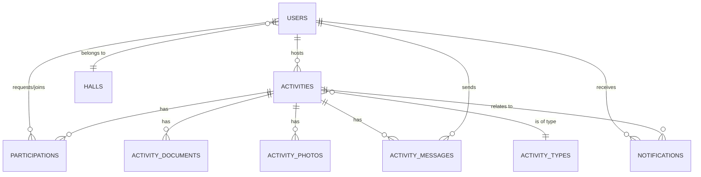

# Database Requirements

**No database exists today.** This document infers a candidate data model purely from the shapes already present in the frontend (`src/lib/*-store.ts`, `src/lib/discover-data.ts`) and from the flows described in [BUSINESS_LOGIC.md](./BUSINESS_LOGIC.md). It is a **starting point for backend design discussion**, not a finalized schema, and not an implementation. Database engine choice, exact column types, indexing strategy, and normalization decisions are all **TBD** and left to whoever designs the backend.

## Design Note: Frontend Shapes Are Not a Schema

The current frontend stores two **separate, duplicated arrays** — `pulse_hosted_activities` and `pulse_joined_activities` — where a "joined" activity is a full copy of the activity data, patched independently of the host's copy (see `markCompleted()`/`deleteActivity()` in `activity.manage.$id.tsx` manually pushing updates to both arrays). **This duplication should not be carried into a database design.** A real schema should have exactly one `activities` row per activity, plus a join/junction table for participation, and hosted-vs-joined should be a *query* (activities where `host_id = me` vs. activities the user has an active `participation` row for), not two stored copies. This is the single most important structural correction the backend should make relative to the current prototype.

**Resolved by omission:** [BUSINESS_LOGIC.md](./BUSINESS_LOGIC.md) flags that the frontend's `Activity.joined` counter and its `participants[]` array are two overlapping, occasionally double-counted sources of "how many people are in this activity" (`a.joined + activeParticipants` in `activity.view.$id.tsx`). The `activities` table proposed below deliberately has **no `joined`/participant-count column** — participant count should always be derived as `COUNT(participations WHERE status = 'accepted')`, never stored redundantly. This is the schema-level resolution of that frontend inconsistency, not an oversight.

## Inferred Entities

> **Note on id types below:** every table in this section shows `id: UUID/PK` for illustration only. As stated above, the actual database engine and column types are **TBD** — treat every `UUID/PK` mention as a placeholder for "some primary key strategy," not a decision to auto-increment integers vs. UUIDs vs. anything else.

### `users`

Backing [profile-store.ts](../src/lib/profile-store.ts)'s `Profile` type.

| Field | Inferred type | Notes |
|---|---|---|
| `id` | UUID/PK | Not present client-side (client has no concept of a real user id yet) |
| `name` | string | |
| `institute_email` | string, unique | Domain appears fixed to `@kgpian.iitkgp.ac.in` — confirm whether this constraint should be enforced server-side; multi-institute support is **TBD** |
| `email_verified` | boolean | |
| `phone` | string, nullable | |
| `phone_verified` | boolean | |
| `year` | enum/string | Observed values: "1st Year"–"5th Year", "PG" (profile screens) vs. graduation years like "2026"–"2030" (onboarding) — **these two value sets are inconsistent in the current frontend and should be reconciled**, see note below |
| `department` | string | Freeform text field currently |
| `hall` | string | Should likely be a foreign key to a `halls` reference table (see below) rather than freeform text, given it's chosen from a fixed list in the UI |
| `gender` | enum/string | Observed values: "Male", "Female", "Non-binary", "Prefer not to say" (profile). Onboarding presents the **same four values** in a different order with different internal option-value casing (`nonbinary`, `prefer_not`) — this is a cosmetic/implementation difference, not a real taxonomy mismatch, and does not need reconciling the way `hall`/`year` do below |
| `photo_url` | string, nullable | Currently a client-only blob URL — needs real storage, see [FILE_STORAGE_PLAN.md](./FILE_STORAGE_PLAN.md) |
| `host_verified_at` | timestamp, nullable | Set once a user completes host verification |
| `created_at` / `updated_at` | timestamp | Standard audit columns, not present client-side |

**Inconsistency to resolve (not resolved by this document):** `year` is represented two different ways in the current frontend — as class-standing ("3rd Year") on profile/onboarding-profile screens, and as a graduation year (2026–2030) as an onboarding form option. Pick one representation for the backend schema — **TBD, requires a product decision**.

### `halls` (reference/lookup table — proposed, does not exist client-side as a distinct entity)

The onboarding hall-selection screen ([index.tsx](../src/routes/index.tsx)) and the profile hall dropdown ([profile.index.tsx](../src/routes/profile.index.tsx)) use **two different hardcoded hall lists** that don't fully match:

- Onboarding: RK, Nehru, Patel, LLR, Azad, SN, MMM, MS (8 halls, each with a decorative gradient).
- Profile: RP, LLR, Nehru, Azad, Patel, RK, MMM, SNIG, MS, HJB, VS, BR, SAM (13 halls).

These lists should be reconciled into a single authoritative source (likely a `halls` table) before backend work begins — **TBD, requires confirming the real/complete list of IIT Kharagpur halls with the product owner.**

### `activities`

Backing `StoredActivity` in [activity-store.ts](../src/lib/activity-store.ts), merged with the base `Activity` shape in [discover-data.ts](../src/lib/discover-data.ts).

| Field | Inferred type | Notes |
|---|---|---|
| `id` | UUID/PK | Client currently generates its own id (`makeId()`) — a real backend should assign this server-side |
| `host_id` | FK → `users.id` | Currently just a display-name string (`host`) + a denormalized `hostProfile` object — should become a real foreign key |
| `type_slug` | FK → `activity_types.slug` **only if `activity_types` becomes a real table** (see below); otherwise a plain string validated against the static frontend taxonomy | This relationship is conditional on the not-yet-decided `activity_types` storage question directly below — do not treat it as a settled FK until that's resolved |
| `title` | string | Currently defaults to the activity type's display name |
| `emoji` | string | Currently copied from the activity type |
| `about` | text, nullable | |
| `date` | date | Stored as an ISO date string from `<input type="date">` |
| `time` | time | Stored as `HH:MM` from `<input type="time">`, plus a separately-formatted display string — schema should store a real time/timestamp and format for display server-side or client-side, not persist a pre-formatted string. **Timezone convention is unspecified** — the current frontend stores naive `HH:MM`/date strings with no timezone information at all. Given the product is scoped to a single campus, a single fixed timezone (e.g. IST) is a plausible convention, but this has not been decided anywhere — **TBD** |
| `activity_location` | string | |
| `meetup_point` | string, nullable | Falls back to `activity_location` if not set |
| `accept_requests_until` | time, nullable | Cutoff for new join requests |
| `gender_restriction` | enum | "Everyone" / "Men" / "Women" |
| `eligibility_tags` | string[] or join table | "Everyone", "Freshers", "2nd Year"..."4th Year", "PG" — multi-select |
| `capacity` | integer | |
| `cost_per_person` | decimal, nullable | Currency assumed INR (₹) throughout the UI — multi-currency is **not** a current requirement based on the frontend |
| `chat_enabled` | boolean | |
| `status` | enum | `upcoming` \| `ongoing` \| `completed` — note: no `cancelled` state currently exists in the frontend; whether hosts need a distinct "cancel" (vs. delete) action is **TBD** |
| `created_at` / `updated_at` | timestamp | |

### `activity_types` (reference/lookup table)

Backing `CATEGORIES`/`ALL_TYPES` in [discover-data.ts](../src/lib/discover-data.ts) — currently a **static, hardcoded, client-side-only** taxonomy of 5 categories and 34 types (Daily Life, Recreation, Creative, Sports, Learning & Networking). Whether this taxonomy should move server-side (to allow adding types without a frontend deploy) is **TBD** — it may be acceptable to keep it as static frontend configuration long-term. **This decision directly determines whether `activities.type_slug` above can be a real foreign key or must remain a validated string** — if the taxonomy stays static/frontend-only, there is no server-side table for it to reference.

| Field | Inferred type |
|---|---|
| `slug` | string/PK |
| `name` | string |
| `emoji` | string |
| `category` | string or FK → `activity_categories` |

### `participations` (proposed join table — replaces the current duplicated joined-array design)

There is no clean equivalent of this in the current frontend (participation is embedded per-activity as `StoredParticipant[]`, and duplicated again as a whole separate "joined" activity copy per user). Proposed shape:

| Field | Inferred type | Notes |
|---|---|---|
| `id` | UUID/PK | |
| `activity_id` | FK → `activities.id` | |
| `user_id` | FK → `users.id` | |
| `status` | enum | Needs to cover: `requested`, `accepted`/`joined`, `declined`, `left`, `removed` — the current frontend's `TeaStatus` (`none/requested/accepted/ongoing/declined`) and `StoredParticipant.removedAt`/`StoredActivity.leftAt` are two different partial encodings of what should be one lifecycle enum |
| `requested_at` | timestamp | |
| `responded_at` | timestamp, nullable | When the host accepted/declined |
| `left_at` | timestamp, nullable | Participant-initiated leave |
| `left_reason` | text, nullable | Currently collected in the UI (`LeaveActivityDialog`) but **discarded, never persisted** — decide whether to actually store this going forward |
| `removed_at` | timestamp, nullable | Host-initiated removal |

### `activity_documents`

Backing `StoredDoc`:

| Field | Inferred type |
|---|---|
| `id` | UUID/PK |
| `activity_id` | FK → `activities.id` |
| `uploaded_by` | FK → `users.id` (not tracked client-side today, but should be) |
| `name` | string (original filename) |
| `kind` | enum: `pdf` \| `image` \| `file` \| `link` |
| `url` | string (real storage URL — see [FILE_STORAGE_PLAN.md](./FILE_STORAGE_PLAN.md)) |
| `created_at` | timestamp |

### `activity_photos`

Backing `StoredPhoto` — same shape considerations as documents, only ever populated once an activity is `completed`, uploaded by the host (or possibly participants — **TBD**, current UI only exposes upload to the host).

### `activity_messages` (proposed — no persistence exists client-side at all today)

`ActivityChat` currently has zero backing data model since it's local-only. A real implementation needs at minimum:

| Field | Inferred type |
|---|---|
| `id` | UUID/PK |
| `activity_id` | FK → `activities.id` |
| `sender_id` | FK → `users.id` |
| `body` | text |
| `created_at` | timestamp |

### `notifications` / `reminders` (proposed — no persistence exists client-side at all today)

`activity.$id.notifications.tsx` currently renders hardcoded seed content for any activity id. A real implementation needs, at minimum:

| Field | Inferred type |
|---|---|
| `id` | UUID/PK |
| `user_id` | FK → `users.id` (recipient) |
| `activity_id` | FK → `activities.id`, nullable (some notifications may not be activity-scoped) |
| `type` | enum — see [NOTIFICATION_ARCHITECTURE.md](./NOTIFICATION_ARCHITECTURE.md) for a fuller list of trigger types |
| `message` | text |
| `read_at` | timestamp, nullable |
| `created_at` | timestamp |
| (reminders likely need a `scheduled_for` timestamp + delivery-state tracking, distinct from notifications) |

## Entity Relationship Sketch

> **Diagram caveat:** the `ACTIVITIES }o--|| ACTIVITY_TYPES` relationship drawn above assumes `activity_types` becomes a real table. If that TBD resolves the other way (taxonomy stays static frontend config), this edge does not exist as a database-level foreign key — `type_slug` would instead be a plain, application-validated string. Do not treat this diagram as confirming that decision.

## Explicitly Out of Scope / TBD

- Database engine (Postgres, MySQL, etc.) — **TBD**.
- Primary key strategy (UUID vs. auto-increment integer vs. other) — **TBD**; every `UUID/PK` in this document is illustrative only, per the note at the top of "Inferred Entities."
- Whether `activity_types`/`halls` are seeded reference tables or remain static frontend config — **TBD**.
- Soft-delete vs. hard-delete conventions across all tables — **TBD** (the current frontend mixes both: activities are hard-deleted, participations are soft-deleted with a timestamp).
- Multi-tenancy / multi-campus support — **TBD**.
- Retention policy for chat messages, notifications, and deleted activities — **TBD**.
- Whether `left_reason` (currently collected and discarded) should be persisted and, if so, who can see it (host only? never shown?) — **TBD**.
- Canonical timezone for `date`/`time` storage — **TBD** (see note on the `activities.time` field above).
- What happens to a user's hosted activities and participations if their account is deleted (orphaned rows vs. cascading delete vs. anonymized retention) — **TBD**; see [AUTHENTICATION_PLAN.md](./AUTHENTICATION_PLAN.md) for the related account-deletion question.

This document intentionally stops at "requirements and a candidate model." Table/column naming, exact types, indexes, and migrations are implementation decisions for the backend engineering phase — see [BACKEND_IMPLEMENTATION_PLAN.md](./BACKEND_IMPLEMENTATION_PLAN.md).
