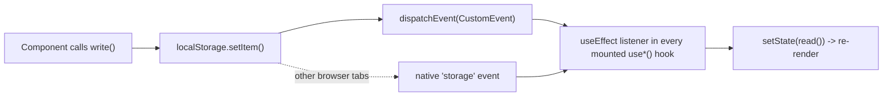

# State Management

Pulse has **no global state library** (no Redux, Zustand, Jotai, Context-based store, etc.). All cross-component state is handled by three hand-rolled `localStorage`-backed "stores," plus ordinary local component `useState`/`useEffect` for anything screen-local (form fields, modal open/closed, etc.).

## The Shared Store Pattern

All three stores ([activity-store.ts](../src/lib/activity-store.ts), [profile-store.ts](../src/lib/profile-store.ts), [tea-status.ts](../src/lib/tea-status.ts)) follow the same hand-written pattern:

1. A plain **read function** that parses JSON out of `localStorage` (guarded by `typeof window === "undefined"` for SSR safety, defaulting to an empty/default value).
2. A plain **write function** that serializes to `localStorage.setItem(...)` and then dispatches a `window.dispatchEvent(new CustomEvent(EVT))` where `EVT` is a store-specific event name string.
3. A **`use*` hook** that holds the value in `useState` (initialized from the read function) and, in a `useEffect`, subscribes to both the custom event (same-tab reactivity — since `storage` events don't fire in the tab that made the change) and the native `window "storage"` event (cross-tab reactivity), re-reading and re-setting state on either.

This is effectively a manual, minimal re-implementation of what `useSyncExternalStore` + a pub/sub store would give for free — it works, but note it is **not** built on React's official external-store API, and there is no memoization/selector support (every subscriber re-reads and re-renders on any write, even if the specific slice they care about didn't change).



## Store 1: Profile Store

**File:** [src/lib/profile-store.ts](../src/lib/profile-store.ts)
**Key:** `pulse_profile` · **Event:** `pulse-profile-change`

```ts
type Profile = {
  name: string;
  year: string;
  department: string;
  hall: string;
  gender: string;
  email: string;
  phone: string;
  photo?: string;          // object URL — not durable, see FILE_STORAGE_PLAN.md
  phoneVerified: boolean;
  emailVerified: boolean;
  hostVerifiedAt?: number; // epoch ms
};
```

- `DEFAULT_PROFILE` is a hardcoded seed user (name "Aaditya D.", RP Hall, 3rd Year CSE) — every fresh browser starts "logged in" as this fictional user; there is no real account creation wired to this store. This is compounded by onboarding itself: its Profile and Hall steps collect real form input but never call `updateProfile()`, so even completing onboarding doesn't override `DEFAULT_PROFILE` — see [BUSINESS_LOGIC.md](./BUSINESS_LOGIC.md) §"Onboarding Profile & Hall Data Is Collected But Discarded."
- `getProfile()`, `saveProfile()`, `updateProfile(patch)`, `useProfile()` are the public API.
- `isHostReady(profile)` — a derived helper (`phoneVerified && phone && photo`) gating the ability to host an activity. Used by `BottomNav` and `host.verify.tsx`.

## Store 2: Activity Store

**File:** [src/lib/activity-store.ts](../src/lib/activity-store.ts)
**Keys:** `pulse_hosted_activities`, `pulse_joined_activities` · **Event:** `pulse-activity-store-change`

This is the primary domain data store — see [DATABASE_REQUIREMENTS.md](./DATABASE_REQUIREMENTS.md) for the full type breakdown of `StoredActivity`. Public API:

| Function | Purpose |
|---|---|
| `getHosted()` / `getJoined()` | Read the full array for that list |
| `saveHosted(list)` / `saveJoined(list)` | Overwrite the full array (write + broadcast) |
| `addHosted(activity)` / `addJoined(activity)` | Prepend a new activity |
| `updateHosted(id, patch)` / `updateJoined(id, patch)` | Shallow-merge a patch into the matching activity |
| `removeHosted(id)` / `removeJoined(id)` | Filter out an activity by id |
| `getById(id)` | Looks in hosted first, then joined; returns `{ activity, kind: "hosted" \| "joined" }` or `null` |
| `isExpired(timestamp)` | `Date.now() - ts >= 24h` — used to auto-hide "left"/"removed" cards |
| `useHosted()` / `useJoined()` | Reactive hooks |
| `makeId()` | Generates a client-side id: `` `a_${Date.now().toString(36)}_${random}` `` — **not a real primary key strategy for a database**, see DATABASE_REQUIREMENTS.md |
| `DEFAULT_HOST` | Hardcoded host-profile fallback ("Aaditya D.", RP Hall, 3rd Year, placeholder phone) used when creating new hosted activities |

Every write is a **full read-modify-write of the entire array** — there is no partial/indexed update. This is acceptable at prototype scale but does not resemble how a real backend would model updates (row-level, or a mutation endpoint per action).

## Store 3: Tea-Status (Demo Simulation Store)

**File:** [src/lib/tea-status.ts](../src/lib/tea-status.ts)
**Keys:** `pulse_tea_status`, `pulse_tea_activity_id` · **Event:** `pulse-tea-status-change`

This store exists solely to simulate a two-sided join/accept/decline flow for a single hardcoded demo activity type ("Tea & Coffee", seeded in `discover-data.ts`), **without a second real user** — the same user clicks buttons like "Simulate accept" / "Simulate decline" / "Simulate start time reached" to walk the one activity through its lifecycle.

```ts
type TeaStatus = "none" | "requested" | "accepted" | "ongoing" | "declined";
```

It also exposes a small **session-scoped** (not localStorage) navigation-intent helper, `setActivityNav`/`consumeActivityNav`, using `sessionStorage` — used so that, e.g., joining a Tea & Coffee activity can navigate to the Activity Hub already scoped to the "Joined → Requested" tab/filter.

**This store is a simulation harness, not a general pattern.** It should not be extended to other activity types — see [BUSINESS_LOGIC.md](./BUSINESS_LOGIC.md) for how deeply it's currently interleaved with the general activity-store logic, and treat that interleaving as technical debt to resolve during backend integration, not a pattern to replicate.

## Other Ad Hoc `localStorage` Keys

A few settings screens read/write their own one-off `localStorage` keys directly, outside of the three formal stores above:

| Key | Set by | Purpose |
|---|---|---|
| `pulse_visited` | `index.tsx`, `TopBar.tsx` (on logout), `settings.index.tsx` (on logout) | Marks onboarding as completed; removed on "logout" to force onboarding again |
| `pulse_notifications` | `settings.notifications.tsx` | Global notification on/off boolean (`"1"`/`"0"`) |
| `pulse_privacy` | `settings.privacy.tsx` | JSON blob of privacy toggle booleans |

These are not reactive (no custom event, no `use*` hook) — they're read once on mount via `useEffect` and written on toggle, with no cross-component subscription.

## React Query — Present, Unused

`@tanstack/react-query`'s `QueryClient` is constructed in [src/router.tsx](../src/router.tsx) and provided via `QueryClientProvider` in [src/routes/__root.tsx](../src/routes/__root.tsx), but **no `useQuery`/`useMutation`/`useSuspenseQuery` call exists anywhere in the current codebase.** This is best read as an intentional seam left for backend integration — the wiring is already in place for whoever connects the app to a real API.

## Implications for Backend Integration

When a real backend exists, the natural migration path is:

1. Replace the body of each store's read/write functions with React Query `useQuery`/`useMutation` calls against the new API (the store's **public function signatures** — `getHosted`, `updateHosted`, `useHosted`, etc. — could largely be preserved as a compatibility layer to minimize component-level churn, if desired).
2. Replace the custom-event broadcast mechanism with React Query's built-in cache invalidation.
3. Decide what happens to `DEFAULT_PROFILE`/`DEFAULT_HOST` (currently hardcoded fallback data) once real accounts exist — **TBD**.
4. Decide whether `pulse_visited`/`pulse_notifications`/`pulse_privacy` become server-side user preferences or remain client-only device settings — **TBD**.

This document does not implement any of the above; it describes the current state precisely so that migration can be planned deliberately.
