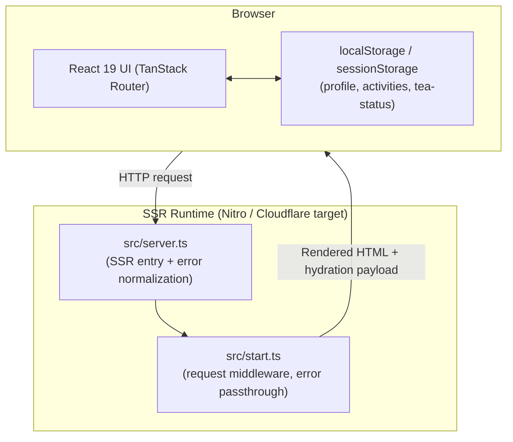
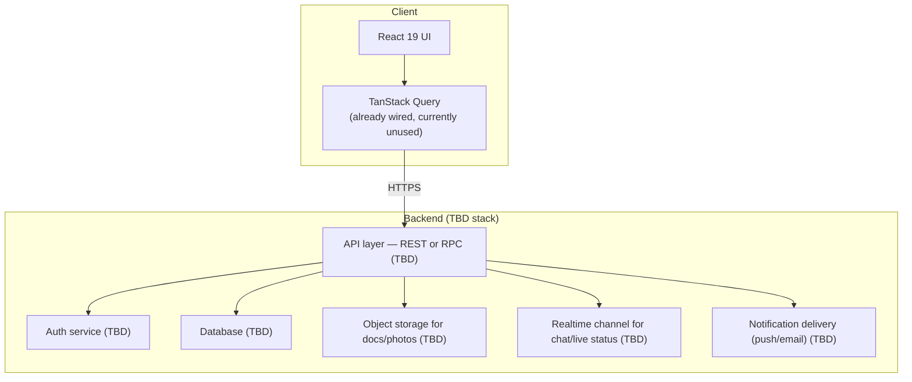

# System Architecture

## Current State: Frontend-Only Prototype

Today, Pulse has **no independent backend service**. The only "server" component is the SSR runtime built into TanStack Start itself, which renders React to HTML on request and serves the client bundle. There is no application server, no database, and no external API.

There is no arrow from the browser to any database or API in the current system — by design, none exists yet.

## Request Flow (Today)

1. Browser requests a route (e.g. `/activity`).
2. `src/server.ts` delegates to the TanStack Start server entry, wrapped in try/catch to normalize any 500s that h3 (the underlying server toolkit) would otherwise swallow into an opaque JSON error.
3. `src/start.ts` registers `errorMiddleware`, which also catches unhandled errors during the request lifecycle and renders a static fallback page (`src/lib/error-page.ts`) rather than crashing.
4. On success, the router (`src/router.tsx`) resolves the matched route from the generated `routeTree.gen.ts`, renders the route component, and returns HTML + hydration data.
5. Once hydrated client-side, **all further interaction is entirely client-side** — reading/writing `localStorage`, no network calls for data.

## Why React Query Is Present But Inert

`@tanstack/react-query` is installed and a `QueryClient` is constructed and provided via router context (`src/router.tsx`, `src/routes/__root.tsx`), but **no component in the codebase calls `useQuery` or `useMutation`**. This is scaffolding left in place for future backend integration, not an active data-fetching layer. Treat its presence as a signal of intended direction (client calls a real API via React Query) rather than evidence of current API usage.

## Deployment

- Build tool: Vite 8, configured via `@lovable.dev/vite-tanstack-config` (see [vite.config.ts](../vite.config.ts)). This shared config already wires in TanStack Start, TanStack DevTools, `viteReact`, Tailwind, `tsConfigPaths`, and Nitro.
- Nitro's default target in this config is **Cloudflare** — actual production hosting target is **TBD** (may or may not be Cloudflare in practice; confirm with the team/infra owner).
- The custom SSR entry (`src/server.ts`) exists specifically to intercept and normalize 500-level responses before they reach the client, regardless of the underlying edge/server runtime.

## Target Architecture (Once a Backend Exists)

The shape below is a **proposed target**, not a decision that has been made. Specific technology choices (database engine, API style, hosting provider) are intentionally left TBD in the relevant documents ([DATABASE_REQUIREMENTS.md](./DATABASE_REQUIREMENTS.md), [API_REQUIREMENTS.md](./API_REQUIREMENTS.md), [BACKEND_IMPLEMENTATION_PLAN.md](./BACKEND_IMPLEMENTATION_PLAN.md)).

> **Diagram caveat:** this shows all client traffic funneling through the API layer, which holds for most operations. It does **not** necessarily hold for file uploads — a common object-storage pattern is for the client to request a pre-signed URL from the API and then upload the file **directly to storage**, bypassing the API layer for the upload itself. See [FILE_STORAGE_PLAN.md](./FILE_STORAGE_PLAN.md) and Phase 3 of [BACKEND_IMPLEMENTATION_PLAN.md](./BACKEND_IMPLEMENTATION_PLAN.md). Whether Pulse's backend uses this pattern is **TBD**; if it does, the `RQ -- HTTPS --> API --> STORAGE` path above should be read as "for most operations," not literally universal.

## Key Architectural Gaps Between Today and a Real Product

| Gap | Current Behavior | Needed |
|---|---|---|
| Persistence | Per-browser `localStorage` | Shared server-side database |
| Auth | Client-side stub checks, no real session | Real authentication + session/token management |
| Multi-user | All flows simulated by a single user acting as both host and participant | True multi-user data isolation and permissions |
| Chat | Local `useState` only, resets on reload, not shared | Persisted, shared, likely real-time messaging |
| Files | `URL.createObjectURL()` blob refs, lost on reload | Durable object storage |
| Notifications | Hardcoded seed arrays, reset every visit | Real, triggered, persisted notifications with delivery |
| Route protection | None — every route is directly navigable | Server-verified auth guards |

## Non-Functional Requirements (TBD)

The following have not been specified anywhere in the current codebase or product artifacts and must be defined before backend implementation begins:

- Expected user scale (concurrent users, total student population size) — **TBD**
- Uptime/availability targets — **TBD**
- Data residency / compliance constraints (student PII, institute affiliation) — **TBD**
- Multi-campus support vs. IIT Kharagpur-only — **TBD**
